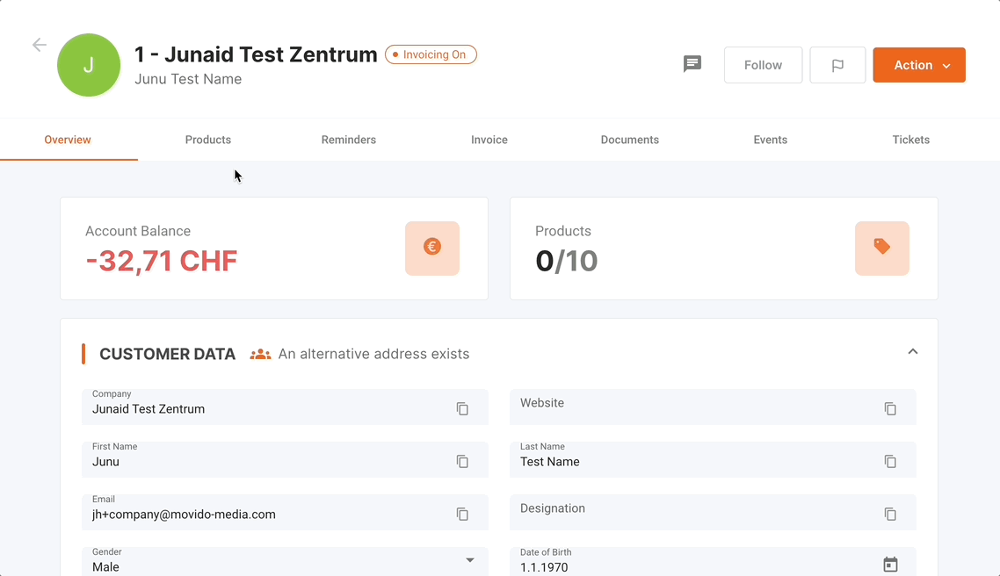
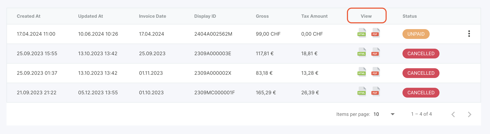
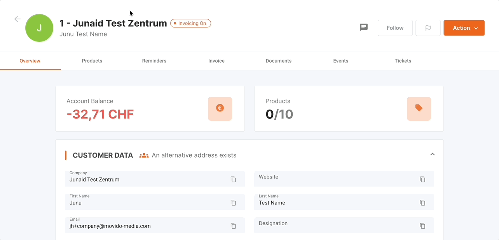
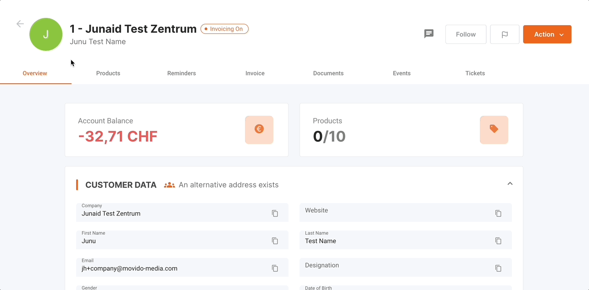
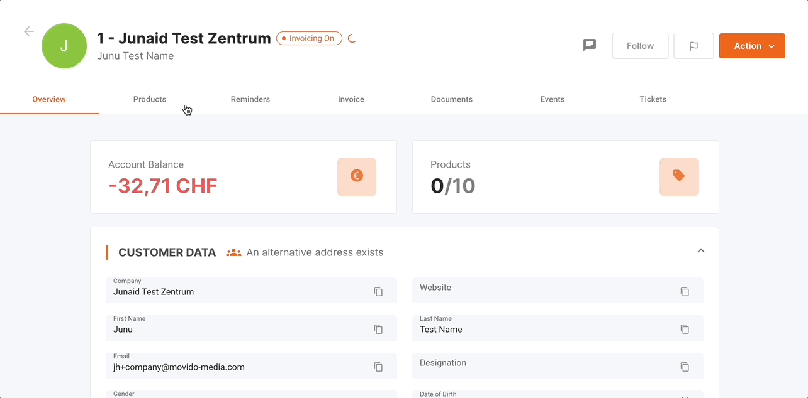
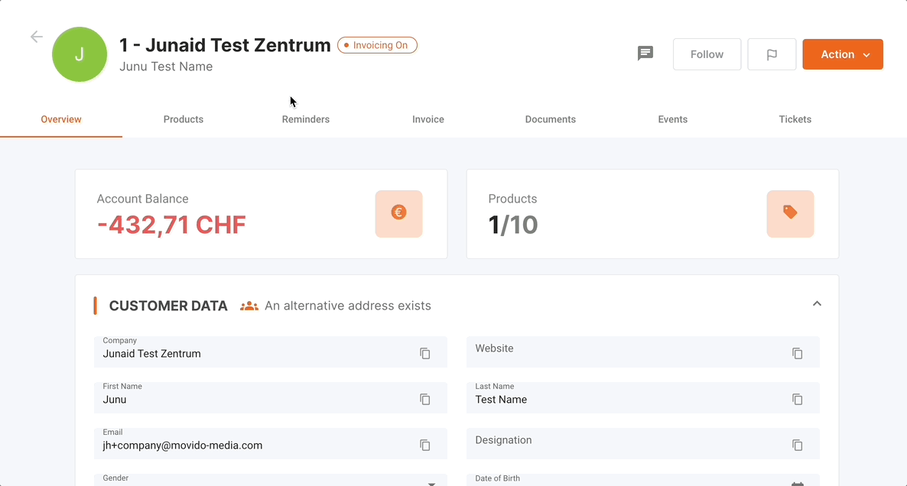

Der Reiter "Rechnungen" im Aadvanto Abrechnungssystem ist dafür ausgelegt, alle Kundenrechnungen zu verwalten. In diesem Abschnitt wird das Anzeigen, Versenden, Stornieren, als bezahlt Markieren und das Verzögern von Rechnungen behandelt. Im Folgenden finden Sie detaillierte Anweisungen, wie Sie diese Funktionen effektiv nutzen können.

### Anzeigen einer Rechnung

Um eine Rechnung anzusehen, gehen Sie wie folgt vor:

1. **Navigieren Sie zum Reiter Rechnungen**: Gehen Sie zum Reiter "Rechnungen", wo Sie eine Liste aller Rechnungen sehen können, kategorisiert nach Status: Pausiert, Unbezahlt, Bezahlt und Zukünftige Rechnungen.

   

2. **Lokalisieren Sie die Rechnung**: Finden Sie die Rechnung, die Sie anzeigen möchten. Die Tabelle zeigt die folgenden Informationen für jede Rechnung an:
   - **Erstellungsdatum**: Das Datum und die Uhrzeit, zu der die Rechnung erstellt wurde.
   - **Letzte Aktualisierung**: Das letzte Datum und die Uhrzeit, zu der die Rechnung aktualisiert wurde.
   - **Rechnungsdatum**: Das offizielle Datum der Rechnung.
   - **Anzeige-ID**: Eine eindeutige Kennung für die Rechnung.
   - **Bruttobetrag**: Der Gesamtbetrag einschließlich Steuern.
   - **Steuerbetrag**: Der Steueranteil des Gesamtbetrags.
   - **Sichtbarkeit**: Gibt an, ob die Rechnung im HTML- oder PDF-Format verfügbar ist.
   - **Status**: Zeigt den aktuellen Status der Rechnung (z.B. Unbezahlt, Bezahlt, Storniert).

3. **Zugriff auf Rechnungsdetails**: Unter dem Reiter "Anzeigen" klicken Sie auf das PDF-Symbol, um die Rechnung als PDF herunterzuladen, oder auf das HTML-Symbol, um die Rechnung in Ihrem Browser anzuzeigen.

   

Diese Aktion ermöglicht Ihnen direkten Zugriff auf die vollständige Rechnung mit allen relevanten Informationen in Ihrem bevorzugten Format.

### Versenden einer Rechnung

Um eine Rechnung an einen Kunden zu senden, gehen Sie wie folgt vor:

1. **Navigieren Sie zum Reiter Dokumente**: Gehen Sie zum Reiter "Dokumente" und finden Sie die Rechnung, die Sie versenden möchten. Sie können die benötigte Rechnung visualisieren, indem Sie nach Kriterien wie Erstellungsdatum oder Name sortieren.

2. **Öffnen Sie das Aktionsmenü**: Klicken Sie auf das Drei-Punkte-Menü (⋮) neben dem Rechnungsstatus, um das Dropdown-Menü zu öffnen.

3. **Wählen Sie Teilen**: Wählen Sie im Dropdown-Menü "Per E-Mail teilen" oder "Per Post teilen". Dadurch wird ein Dialogfeld geöffnet, in dem Sie die Versandmethode der Rechnung auswählen können. Bestätigen Sie die Empfängerdetails und senden Sie die Rechnung.

   

### Stornieren einer Rechnung

Um eine Rechnung zu stornieren, gehen Sie wie folgt vor:

1. **Navigieren Sie zum Reiter Rechnungen**: Gehen Sie zum Reiter "Rechnungen" und finden Sie die Rechnung, die Sie stornieren müssen.

2. **Öffnen Sie das Aktionsmenü**: Klicken Sie auf das Drei-Punkte-Menü (⋮) neben dem Rechnungsstatus, um das Dropdown-Menü zu öffnen.

3. **Wählen Sie Stornieren**: Wählen Sie im Dropdown-Menü "Stornieren", um den Stornierungsprozess zu starten. Dadurch wird ein Stornierungsdialog geöffnet.

4. **Geben Sie einen Stornierungsgrund an**: Im erscheinenden Dialogfeld müssen Sie einen Grund für die Stornierung angeben. Dieser Grund ist wichtig für die Aufzeichnung und Prüfzwecke.

5. **Bestätigen Sie die Stornierung**: Nach Eingabe des Grundes klicken Sie auf "Rechnung stornieren", um die Stornierung zu bestätigen. Der Rechnungsstatus wird auf "Storniert" aktualisiert und der Datensatz wird diese Änderung widerspiegeln.

   

### Manuelles Markieren einer Rechnung als bezahlt

Um eine Rechnung manuell als bezahlt zu markieren, gehen Sie wie folgt vor:

1. **Navigieren Sie zum Reiter Rechnungen**: Gehen Sie zum Reiter "Rechnungen" und finden Sie die Rechnung, die Sie als bezahlt markieren müssen.

2. **Öffnen Sie das Aktionsmenü**: Klicken Sie auf das Drei-Punkte-Menü (⋮) neben dem Rechnungsstatus, um das Dropdown-Menü zu öffnen.

3. **Wählen Sie Als bezahlt markieren**: Wählen Sie im Dropdown-Menü "Als bezahlt markieren". Dadurch wird ein Bestätigungsdialog geöffnet.

4. **Bestätigen Sie die Aktion**: Klicken Sie auf "Bestätigen", um die Rechnung als bezahlt zu markieren. Der Status der Rechnung wird auf "Bezahlt" geändert.

   

### Manuelles Abschreiben einer Rechnung

Die Funktion "Abschreiben" ermöglicht es Ihnen, kleine Abweichungen bei Zahlungsbeträgen zu handhaben, sodass Rechnungen als beglichen gelten, selbst wenn geringe ausstehende Beträge vorhanden sind.

### Schritte zum Abschreiben einer Rechnung:

1. **Rechnung finden**:
   - Navigieren Sie zum Abschnitt "Rechnungen" im Hauptmenü.
   - Finden Sie die spezifische Rechnung, die abgeschrieben werden soll.

2. **Zugriff auf das Optionsmenü**:
   - Klicken Sie auf das Drei-Punkte-Menü (⋮) neben dem Rechnungsstatus.

3. **Wählen Sie "Rechnung abschreiben"**:
   - Wählen Sie die Option "Rechnung abschreiben" aus dem Dropdown-Menü.

4. **Bestätigen Sie die Abschreibung**:
   - Ein Bestätigungsdialog erscheint. Bestätigen Sie die Aktion, um die geringfügige Abweichung abzuschreiben.

   

### Verzögern einer Rechnung

Um eine Rechnung zu verzögern, gehen Sie wie folgt vor:

1. **Navigieren Sie zum Reiter Rechnungen**: Gehen Sie zum Reiter "Rechnungen" und finden Sie die Rechnung, die Sie verzögern müssen.

2. **Öffnen Sie das Aktionsmenü**: Klicken Sie auf das Drei-Punkte-Menü (⋮) neben dem Rechnungsstatus, um das Dropdown-Menü zu öffnen.

3. **Wählen Sie Verzögern**: Wählen Sie im Dropdown-Menü "Verzögern", um das Fälligkeitsdatum der Rechnung zu verschieben. Dadurch wird ein Verzögerungsdialog geöffnet.

4. **Neues Datum angeben**: Wählen Sie im erscheinenden Dialogfeld das neue Fälligkeitsdatum für die Rechnung.

5. **Bestätigen Sie die Aktion**: Klicken Sie auf "Bestätigen", um die Rechnung zu verzögern. Das Fälligkeitsdatum der Rechnung wird entsprechend aktualisiert.

   

### Zusätzliche Rechnungsaktionen

Das Dropdown-Menü bietet auch zusätzliche Aktionen, die an einer Rechnung ausgeführt werden können:

- **Dokument regenerieren**: Wenn Updates oder Korrekturen erforderlich sind, können Sie das Rechnungsdokument neu generieren.

Durch Befolgen dieser Schritte können Sie alle Aufgaben im Zusammenhang mit der Rechnungsstellung im Aadvanto Abrechnungssystem effizient verwalten und so genaue und aktuelle Finanzaufzeichnungen sicherstellen.