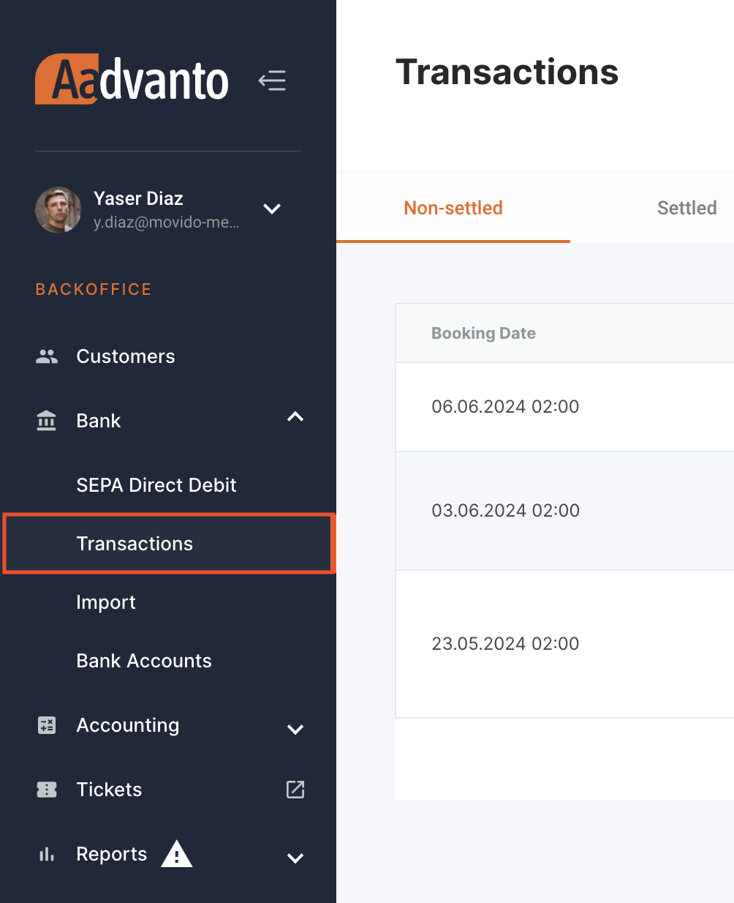
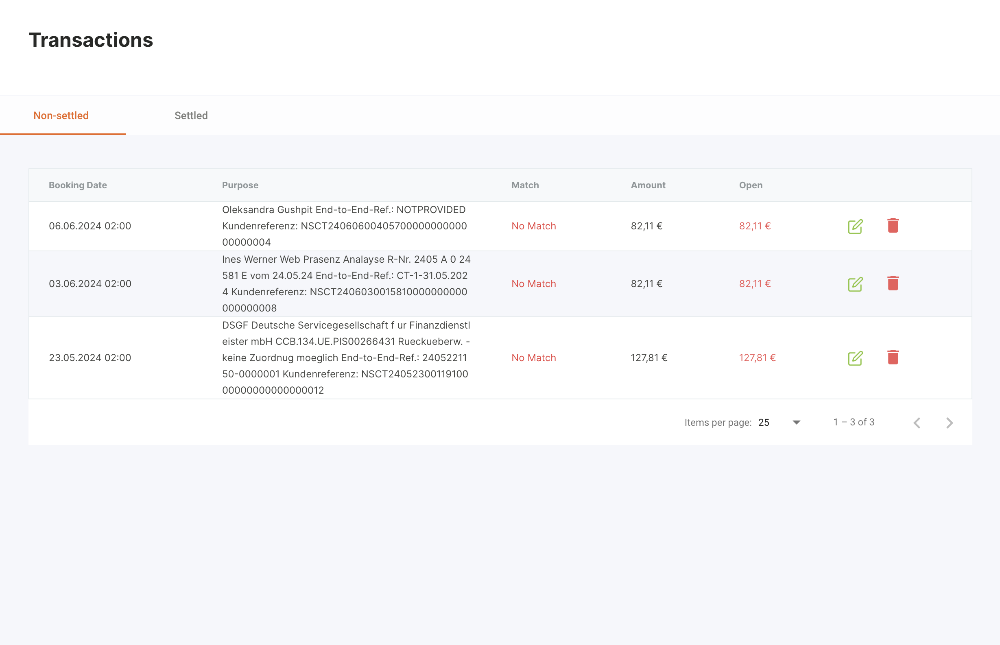
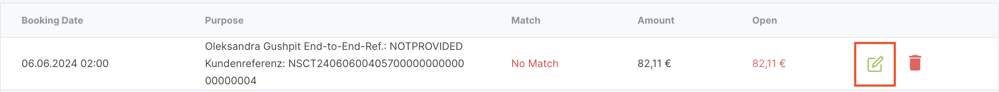
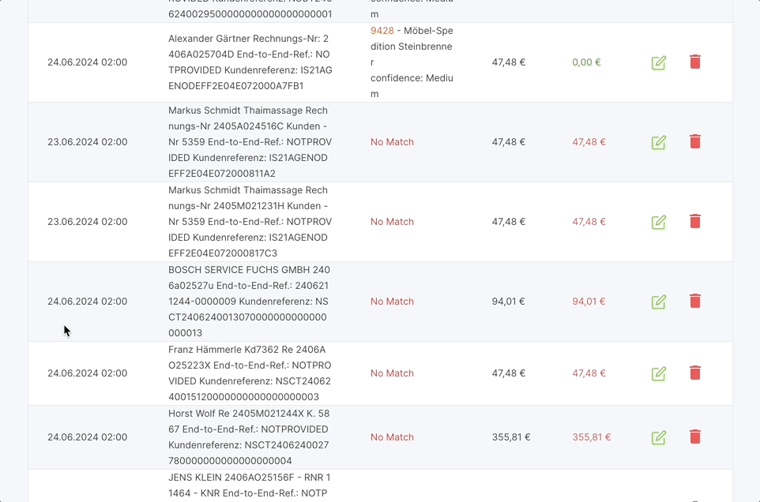
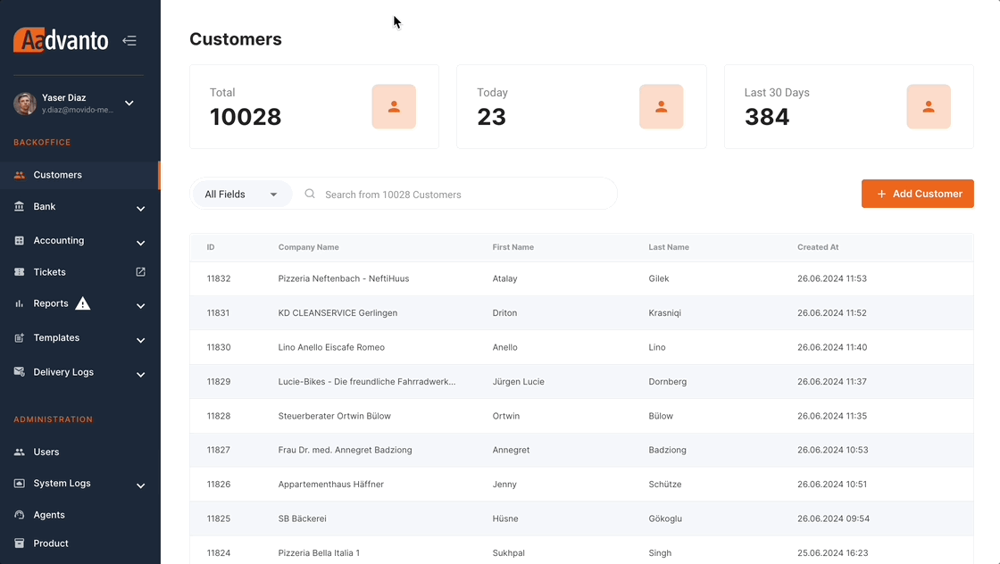
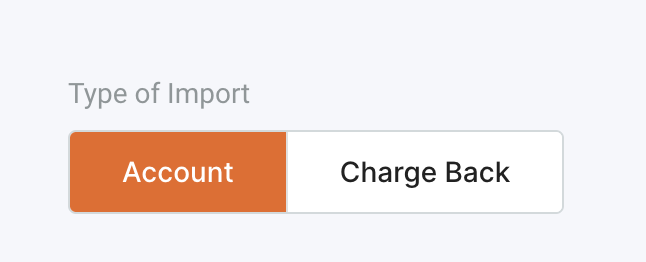
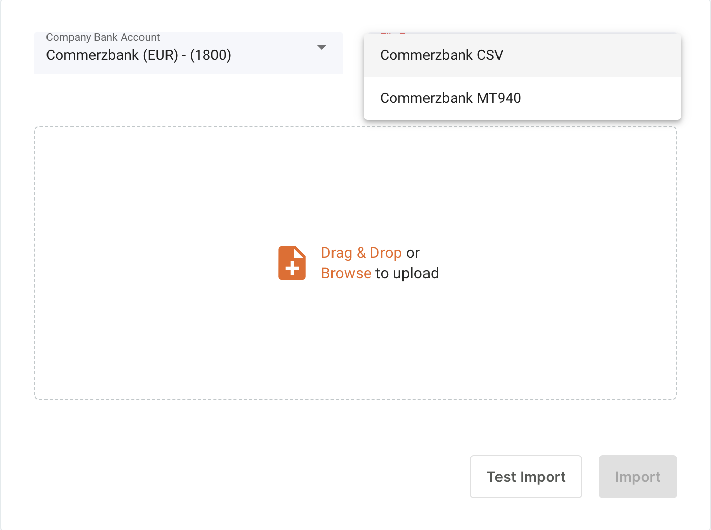

Der Reiter "Transaktionen" im Aadvanto Abrechnungssystem ist entscheidend für die Verwaltung und Buchung von Zahlungen. In diesem Abschnitt werden der Prozess der Zuordnung eines Zahlers und die Buchung einer Zahlung behandelt. Im Folgenden finden Sie detaillierte Anweisungen, wie Sie diese Funktionen effektiv nutzen können.

### Buchung einer Zahlung / Zuweisung eines Zahlers

Um eine Zahlung zu buchen oder einen Zahler zuzuweisen, gehen Sie wie folgt vor:

1. **Navigieren Sie zum Reiter Transaktionen**: Gehen Sie zum Reiter "Transaktionen" unter dem Abschnitt "Bank". Hier finden Sie alle Zahlungen, die an diesem Tag auf Ihrem Konto eingegangen sind.

   

2. **Lokalisieren Sie die Zahlung**: Finden Sie die Zahlung, die Sie buchen möchten. Die Tabelle zeigt die folgenden Informationen für jede Transaktion an:
   - **Buchungsdatum**: Das Datum und die Uhrzeit, zu der die Zahlung eingegangen ist.
   - **Verwendungszweck**: Der Verwendungszweck oder die Beschreibung der Transaktion.
   - **Übereinstimmung**: Gibt an, ob die Zahlung einem Kunden oder einer Rechnung zugeordnet wurde.
   - **Betrag**: Der Gesamtbetrag der Zahlung.
   - **Offen**: Der noch zuzuweisende Betrag.

   

3. **Bearbeiten der Zahlung**: Klicken Sie auf das grüne Bearbeitungssymbol neben der Transaktion, die Sie buchen möchten. Dadurch öffnet sich ein neues Fenster, in dem Sie den Zahler zuweisen und die Zahlung buchen können.

   

4. **Zuweisung eines Zahlers**: Im Buchungsfenster sehen Sie die Transaktionsdetails. Verwenden Sie das Feld "Kunde suchen", um den entsprechenden Kunden für diese Zahlung zu finden und auszuwählen.

5. **Kunden zuordnen**: Beginnen Sie mit der Eingabe des Kundennamens im Suchfeld. Wählen Sie den richtigen Kunden aus der Dropdown-Liste aus.

6. **Guthaben auf das Kundenkonto hinzufügen**: Sobald der Kunde ausgewählt ist, klicken Sie auf "Guthaben auf das Kundenkonto hinzufügen", um die Zahlung als Guthaben auf das Kundenkonto zu buchen.

7. **Rechnung auswählen (falls zutreffend)**: Wenn die Zahlung zur Begleichung einer bestimmten Rechnung gedacht ist, verwenden Sie das Dropdown-Menü "Rechnung auswählen", um die entsprechende Rechnung auszuwählen. Das System zeigt eine Liste der Rechnungen an, die ausgewählt werden können.

8. **Buchungsbetrag eingeben**: Stellen Sie sicher, dass der Buchungsbetrag dem offenen Rechnungsbetrag entspricht. Wenn es sich um eine Teilzahlung handelt, geben Sie den entsprechenden Betrag ein.

9. **Buchung bestätigen**: Nachdem alle Details korrekt eingegeben wurden, klicken Sie auf die Schaltfläche "Bestätigen", um die Buchung der Zahlung abzuschließen. Die Transaktion wird nun als beglichen markiert und das Kundenkonto entsprechend aktualisiert.

   

Durch Befolgen dieser Schritte können Sie alle Transaktionsbuchungsaufgaben im Aadvanto Abrechnungssystem effizient verwalten und so genaue und aktuelle Finanzaufzeichnungen gewährleisten.

## Verständnis von Teilzahlungen

### Was ist eine Teilzahlung?

Eine Teilzahlung erfolgt, wenn ein Kunde eine Zahlung leistet, die geringer ist als der Gesamtbetrag einer Rechnung. Anstatt auf die vollständige Zahlung zu warten, können Sie den erhaltenen Teilbetrag erfassen. Dies hilft, die Finanzaufzeichnungen genau und aktuell zu halten, während die geleistete Zahlung anerkannt wird.

### Warum Teilzahlungen verwenden?

Teilzahlungen sind in folgenden Situationen nützlich:
- Der Kunde ist nicht in der Lage, den gesamten fälligen Betrag sofort zu zahlen, leistet jedoch eine Teilzahlung als Zeichen des guten Willens.
- Es hilft, den Cashflow aufrechtzuerhalten, indem der erhaltene Betrag umgehend erfasst wird.
- Es sorgt für Transparenz bei finanziellen Transaktionen und offenen Salden.

### Schritte zur Erfassung einer Teilzahlung:

1. **Navigieren Sie zu Transaktionen:**
   - Gehen Sie im Hauptmenü zum Abschnitt "Bank" und wählen Sie "Transaktionen".
   - Hier finden Sie alle Zahlungen, die auf dem Firmenkonto eingegangen sind.

2. **Transaktion bearbeiten:**
   - Finden Sie die entsprechende Transaktion und klicken Sie auf das grüne Bearbeitungssymbol.
   - Dadurch öffnet sich das Buchungsfenster.

3. **Rechnung suchen:**
   - Suchen Sie im Buchungsfenster nach dem Kunden oder der spezifischen Rechnung, auf die sich die Teilzahlung bezieht.

4. **Teilzahlung zuweisen:**
   - Geben Sie den erhaltenen Betrag im Feld "Buchungsbetrag" ein.
   - Stellen Sie sicher, dass der eingegebene Betrag geringer ist als der Gesamtbetrag der Rechnung.

5. **Guthaben auf das Kundenkonto hinzufügen:**
   - Wenn ein nicht zugeordneter Betrag verbleibt, können Sie diesen als Guthaben auf das Kundenkonto hinzufügen.
   - Dieses Guthaben kann zur Begleichung zukünftiger Rechnungen oder offener Salden verwendet werden.

6. **Zuweisung bestätigen:**
   - Nachdem die Teilzahlung eingegeben wurde, überprüfen Sie die Details und klicken Sie auf "Bestätigen", um die Teilzahlung zu erfassen.

### Beispiel-Szenario:

Wenn beispielsweise ein Kunde eine offene Rechnung über 99 € hat, aber nur 49 € zahlt, würden Sie:
- 49 € in das Feld "Buchungsbetrag" für diese spezifische Rechnung eingeben.
- Das System zeigt dann den verbleibenden Betrag von 50 € als noch offen an.

Durch Befolgen dieser Schritte können Sie Teilzahlungen effizient verwalten und erfassen, wodurch sowohl Ihre Finanzaufzeichnungen als auch die Kundensalden genau bleiben.

## Import von Banktransaktionen

In diesem Abschnitt wird der Prozess des Imports von Banktransaktionen in unser Abrechnungssystem behandelt. Diese Funktion ist entscheidend, um sicherzustellen, dass alle Transaktionen genau erfasst und im System verwaltet werden.

### Navigation zum Importbereich

1. **Zugriff auf das Importmenü**
   - Navigieren Sie zum Abschnitt "Bank" in der linken Seitenleiste.
   - Wählen Sie "Import" aus dem Dropdown-Menü unter "Bank".

   

### Einrichtung des Imports

2. **Wählen Sie den Importtyp**
   - Sie haben zwei Optionen: `Konto` und `Rückbuchung`. Wählen Sie `Konto` für den regulären Import von Banktransaktionen.

   

3. **Wählen Sie das Firmenbankkonto und das Dateiformat**
   - Wählen Sie aus dem Dropdown-Menü unter `Firmenbankkonto` das relevante Bankkonto, von dem Sie Transaktionen importieren möchten. Das System unterstützt mehrere Bankkonten und Zahlungsanbieter, einschließlich:
     - Commerzbank (EUR)
     - Nationalbank (EUR)
     - Raiffeisenbank (EUR & CHF)
     - Paypal (EUR, USD & CHF)
     - Amex

   - Wählen Sie anschließend das Dateiformat. Gängige Formate sind `CSV` und `MT940`.

   

4. **Datei hochladen**
   - Ziehen Sie die Transaktionsdatei in den vorgesehenen Bereich oder klicken Sie auf `Durchsuchen`, um sie hochzuladen.

### Importprozess

5. **Transaktionsdateien herunterladen**
   - Melden Sie sich bei jedem Bankkonto an, bei dem Sie ein Konto haben, zum Beispiel Nationalbank.
   - Laden Sie die Transaktionsdatei im entsprechenden Format herunter (z.B. CSV).

6. **Testimport**
   - Führen Sie vor dem Abschluss des Imports einen `Testimport` durch, um Fehler zu überprüfen und sicherzustellen, dass die Datei korrekt formatiert ist. Dieser Schritt ist wichtig, um Diskrepanzen während des eigentlichen Importprozesses zu vermeiden.

7. **Import abschließen**
   - Wenn der Testimport erfolgreich war, klicken Sie auf `Importieren`, um den Prozess abzuschließen. Die Transaktionen werden nun ins System importiert und stehen zur Zuordnung und Buchung bereit.

### Rückerstattungsverwaltung

In unserem Abrechnungssystem ist die Verwaltung von Rückerstattungen ein integraler Bestandteil des Bankimportprozesses. Ebenso wie wir Transaktionen von einer Bank importieren, um Zahlungen Kunden zuzuweisen, verfolgt unser Abrechnungssystem auch Transaktionen, die Rückerstattungen beinhalten. Diese Rückerstattungen, die im Wesentlichen Transaktionen sind, die Gelder an Kunden zurückgeben, werden in unserem System als negative Beträge angezeigt.

Hier ist eine schrittweise Erklärung, wie Rückerstattungen innerhalb des Bankimportprozesses gehandhabt werden:

#### Import von Rückerstattungstransaktionen

1. **Navigieren Sie zum Importbereich**: 
   - Klicken Sie im linken Navigationsmenü auf **Bank** und wählen Sie dann **Import** aus.
   
2. **Importtyp auswählen**:
   - Im Importinterface haben Sie zwei Optionen: **Konto** und **Rückbuchung**. Wählen Sie **Konto**, um mit dem Import von Banktransaktionen fortzufahren.
   
3. **Bankkonto und Dateiformat auswählen**:
   - Wählen Sie aus den Dropdown-Menüs das entsprechende Firmenbankkonto und das Dateiformat für den Import (z.B. CSV, MT940).
   
4. **Datei hochladen**:
   - Ziehen Sie die Datei mit den Banktransaktionen in den vorgesehenen Bereich oder klicken Sie auf **Durchsuchen**, um sie hochzuladen.
   
5. **Testen und Importieren**:
   - Klicken Sie auf **Testimport**, um die Daten zu überprüfen und sicherzustellen, dass alles korrekt aussieht. Wenn alles in Ordnung ist, klicken Sie auf **Importieren**, um fortzufahren.

#### Verwaltung von Rückerstattungstransaktionen

Sobald die Banktransaktionen, einschließlich etwaiger Rückerstattungen, importiert sind, werden diese Transaktionen im System angezeigt:

1. **Anzeigen von Rückerstattungstransaktionen**:
   - Rückerstattungstransaktionen werden in der Transaktionsliste unter **Nicht ausgeglichen** mit einem negativen Betrag angezeigt, der eine Rückerstattung anzeigt. 

2. **Rückerstattungen zuweisen**:
   - Ähnlich wie bei der Buchung einer Zahlung können Rückerstattungen dem entsprechenden Kunden oder der Rechnung zugewiesen werden. Klicken Sie auf das grüne **Bearbeitungssymbol** neben der Rückerstattungstransaktion.
   
3. **Suchen und zuweisen**:
   - Im **Buchungstransaktionsfenster** suchen Sie nach dem Kunden oder der Rechnung, die mit der Rückerstattung verbunden ist. Sobald gefunden, weisen Sie die Rückerstattung entsprechend zu.
   
4. **Zuweisung abschließen**:
   - Nachdem Sie die Rückerstattung dem richtigen Kunden oder der richtigen Rechnung zugewiesen haben, bestätigen Sie die Zuweisung. Die Rückerstattung wird protokolliert und der ausstehende Saldo reduziert oder dem Kundenkonto gutgeschrieben.

Durch Befolgen dieser Schritte werden Rückerstattungen genau verfolgt und im Abrechnungssystem verwaltet, sodass alle Transaktionen, sowohl eingehende als auch ausgehende, korrekt erfasst und verbucht werden.

---

Dies schließt den Abschnitt zur Verwaltung von Rückerstattungen in unserem Abrechnungssystem ab. Das Verständnis und die Nutzung dieser Schritte stellen sicher, dass Rückerstattungen effizient gehandhabt werden, was zu genauen Finanzaufzeichnungen sowohl für das Unternehmen als auch für die Kunden führt.

### Verwaltung von Kundenguthaben

Für den Fall, dass ein Kunde zweimal eine Zahlung für dieselbe Rechnung sendet, ermöglicht unser Abrechnungssystem eine effiziente Handhabung solcher Situationen durch die Verwaltung von Kundenguthaben. So handhaben wir doppelte Zahlungen:

#### Zuweisung der doppelten Zahlung

1. **Import der Transaktion**:
   - Importieren Sie wie üblich die Transaktion von der Bank in das Abrechnungssystem durch den **Import**-Prozess.

2. **Zuweisung der Zahlung**:
   - Navigieren Sie zu **Bank** > **Transaktionen** und lokalisieren Sie die doppelte Zahlung. Klicken Sie auf das grüne **Bearbeitungssymbol**, um die Zahlung zuzuweisen.

3. **Suchen und zuweisen**:
   - Suchen Sie im **Buchungstransaktionsfenster** nach dem Kunden und weisen Sie die Zahlung dessen Konto zu.

#### Verwaltung von Kundenguthaben

Sobald die doppelte Zahlung zugewiesen ist, haben Sie zwei Möglichkeiten zur Handhabung der zusätzlichen Gelder:

1. **Als Guthaben für zukünftige Rechnungen verwenden**:
   - Die zusätzliche Zahlung kann als Guthaben auf dem Kundenkonto gehalten werden. Dieses Guthaben kann automatisch auf zukünftige Rechnungen angewendet werden, wodurch der Betrag reduziert wird, den der Kunde beim nächsten Mal zahlen muss.

2. **Rückerstattung ausstellen**:
   - Alternativ kann der Kunde eine Rückerstattung für die doppelte Zahlung anfordern. Der Rückerstattungsprozess folgt den gleichen Schritten wie andere Rückerstattungen, bei denen die Transaktion verarbeitet und die Gelder an den Kunden zurückgegeben werden.

Durch die effiziente Verwaltung von Kundenguthaben stellt unser Abrechnungssystem sicher, dass doppelte Zahlungen reibungslos gehandhabt werden, was sowohl für den Kunden als auch für das Unternehmen Flexibilität und Komfort bietet.

### Bedeutung des Imports von Banktransaktionen

Der Import von Banktransaktionen ist ein kritischer Schritt im Abrechnungsprozess. Er stellt sicher, dass alle finanziellen Aktivitäten genau erfasst und im Abrechnungssystem verwaltet werden. Dieser Prozess hilft dabei:
- Genaue Finanzaufzeichnungen zu führen.
- Rechtzeitige und genaue Rechnungsstellung sicherzustellen.
- Den Abstimmungsprozess zwischen Bankauszügen und Systemaufzeichnungen zu vereinfachen.
- Die Finanzberichterstattung und -analyse zu verbessern.

Durch Befolgen dieser Schritte können Sie Banktransaktionen effizient in unser Abrechnungssystem importieren und so sicherstellen, dass alle finanziellen Daten aktuell und genau sind.