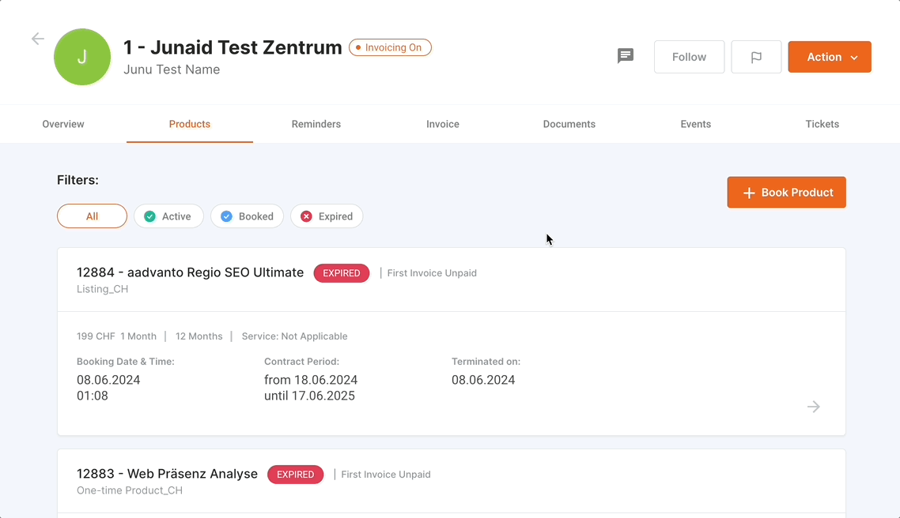
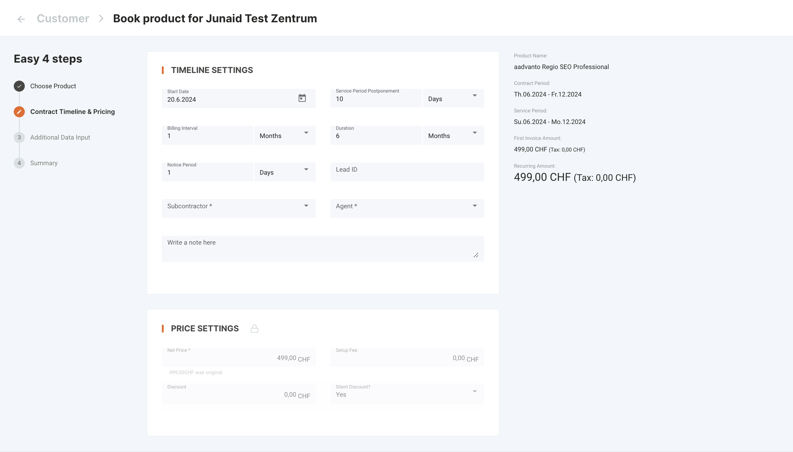
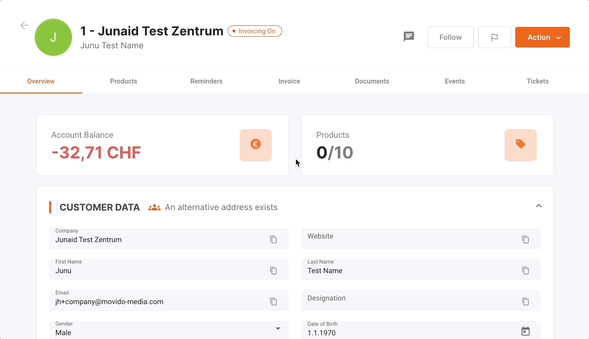
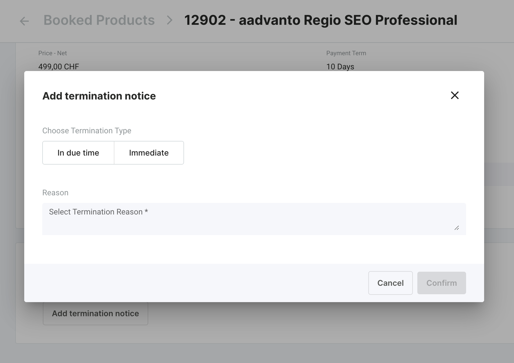
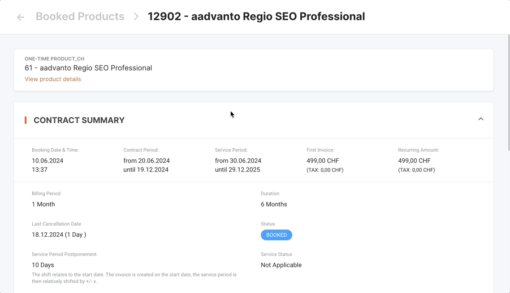
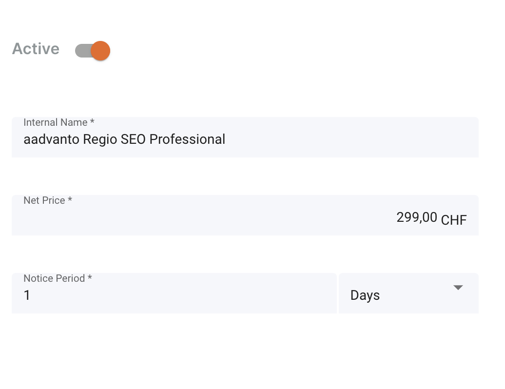

Der Reiter "Produktverwaltung" in unserem Aadvanto Abrechnungssystem ermöglicht Benutzern die Verwaltung aller Aspekte von Kundenprodukten. In diesem Abschnitt werden das Anzeigen vorhandener Produkte, die Buchung neuer Produkte, die Verwaltung von Kündigungen und das Aktualisieren von Produktdetails behandelt. Im Folgenden finden Sie detaillierte Beschreibungen der verfügbaren Funktionen im Bereich Produktverwaltung.

### Vorhandene Produkte

In der Produktübersicht können Sie alle vorhandenen Produkte einsehen, die einem Kunden zugeordnet sind. Jeder Produkteintrag enthält Details wie:

- **Produktname**: Der Name des Produkts.
- **Buchungsdatum und Uhrzeit**: Wann das Produkt gebucht wurde.
- **Vertragslaufzeit**: Die Dauer des Vertrags für das Produkt.
- **Dienstleistungszeitraum**: Der aktive Dienstleistungszeitraum für das Produkt.
- **Status der ersten Rechnung**: Gibt an, ob die erste Rechnung bezahlt oder unbezahl ist.
- **Produktstatus**: Zeigt an, ob das Produkt aktiv, gebucht oder abgelaufen ist.

Sie können die Produkte nach ihrem Status filtern (Alle, Aktiv, Gebucht, Abgelaufen), um bestimmte Produkte leichter zu finden.

### Buchung eines einmaligen Produkts

Um ein einmaliges Produkt für einen Kunden zu buchen, gehen Sie wie folgt vor:

1. **Produkt wählen**: Wählen Sie das gewünschte Produkt aus den verfügbaren Optionen. Produkte sind nach ihrem Typ und ihrer Laufzeit kategorisiert. Sie können den Produktnamen, die Laufzeit und den Preis für jede Option sehen.

   

2. **Vertragszeitraum und Preisgestaltung**: Legen Sie die Details für das ausgewählte Produkt fest, einschließlich:
   - **Startdatum**: Das Datum, an dem der Produktservice beginnt.
   - **Verschiebung des Dienstleistungszeitraums**: Anzahl der Tage, um den Dienstleistungszeitraum bei Bedarf zu verschieben.
   - **Abrechnungsintervall**: Die Häufigkeit der Abrechnung (z.B. täglich, monatlich).
   - **Dauer**: Gesamtdauer des Vertrags.
   - **Kündigungsfrist**: Die Kündigungsfrist für Änderungen oder Kündigungen.
   - **Subunternehmer**: Zuweisung eines Subunternehmers, falls zutreffend.
   - **Agent**: Zuweisung eines Agenten, falls zutreffend.
   - **Notizen**: Fügen Sie relevante Notizen zur Buchung hinzu.

   

3. **Preiseinstellungen**: Definieren Sie die Preisgestaltung für das Produkt:
   - **Nettopreis**: Der Basispreis des Produkts.
   - **Einrichtungsgebühr**: Jede zusätzliche erforderliche Einrichtungsgebühr.
   - **Rabatt**: Anwenden von Rabatten, falls verfügbar.
   - **Stiller Rabatt**: Geben Sie an, ob der Rabatt still angewendet werden soll, ohne den Kunden zu benachrichtigen.

4. **Zusammenfassung**: Überprüfen und bestätigen Sie die Buchungsdetails, bevor Sie den Vorgang abschließen. Stellen Sie sicher, dass alle Informationen korrekt sind, und klicken Sie dann auf "Weiter", um die Buchung abzuschließen.

### Kündigung eines Produkts

Um ein bestehendes Produkt zu kündigen, gehen Sie wie folgt vor:

1. **Produkte aufrufen**: Gehen Sie zum Reiter "Produkte" in der Kundenübersicht, um die vorhandenen Produkte zu sehen. Navigieren Sie zu dem spezifischen Produkt, das Sie kündigen möchten.

   

2. **Kündigungsmitteilung**: Scrollen Sie nach unten zum Abschnitt "Kündigungsmitteilung" und klicken Sie auf "Kündigungsmitteilung hinzufügen", um den Kündigungsprozess zu starten.

   

3. **Details angeben**: Wählen Sie den Kündigungstyp (sofort oder fristgerecht), geben Sie den Grund für die Kündigung an und fügen Sie gegebenenfalls zusätzliche Notizen hinzu.

4. **Kündigung bestätigen**: Bestätigen Sie die Kündigung. Das System wird den Produktstatus aktualisieren, um die Kündigung zu reflektieren.

### Zurückziehen einer Kündigung eines Produkts

Wenn eine Produktkündigung zurückgezogen werden muss, gehen Sie wie folgt vor:

1. **Produktdetails aufrufen**: Gehen Sie zu dem Produkt, das eine ausstehende Kündigung hat.
2. **Kündigung zurückziehen**: Finden Sie den Kündigungseintrag und aktualisieren Sie den Status, um die Kündigung zurückzuziehen.
3. **Änderungen bestätigen**: Bestätigen Sie die Änderungen, um das Produkt in seinen aktiven oder gebuchten Zustand zurückzuversetzen.

### Preisänderung eines Produkts

Um den Preis eines Produkts zu ändern, gehen Sie wie folgt vor:

1. **Produktdetails aufrufen**: Navigieren Sie zu dem Produkt, das Sie aktualisieren möchten. Klicken Sie auf "Produktdetails anzeigen", um die Detailseite des Produkts zu öffnen.

   

2. **Preiseinstellungen**: Finden Sie den Abschnitt "Preiseinstellungen".

   

3. **Preise aktualisieren**: Passen Sie den Nettopreis, die Einrichtungsgebühr und gegebenenfalls Rabatte an.
4. **Änderungen speichern**: Speichern Sie die Änderungen, um die neuen Preise anzuwenden.

### Änderung der Vertragslaufzeit eines Produkts

Um die Vertragslaufzeit eines Produkts zu ändern, gehen Sie wie folgt vor:

1. **Produktdetails aufrufen**: Gehen Sie zu dem Produkt, das Sie aktualisieren möchten. Klicken Sie auf "Produktdetails anzeigen", um die Detailseite des Produkts zu öffnen.
2. **Vertragszeitraum und Preisgestaltung**: Passen Sie in den Produktdetails das Startdatum, das Abrechnungsintervall und die Dauer nach Bedarf an.
3. **Änderungen speichern**: Speichern Sie die Änderungen, um die neuen Vertragsbedingungen anzuwenden.

### Sofortige Kündigung eines Produkts

Für die sofortige Kündigung eines Produkts gehen Sie wie folgt vor:

1. **Produktdetails aufrufen**: Navigieren Sie zu dem Produkt, das Sie kündigen möchten. Klicken Sie auf "Produktdetails anzeigen", um die Detailseite des Produkts zu öffnen.
2. **Kündigungsmitteilung**: Klicken Sie auf "Kündigungsmitteilung hinzufügen" und geben Sie an, dass die Kündigung sofort erfolgen soll.
3. **Details angeben**: Füllen Sie die erforderlichen Informationen und Notizen aus.
4. **Kündigung bestätigen**: Bestätigen Sie die Kündigung, um den Vorgang abzuschließen.

### Abonnement-Produkte

Abonnement-Produkte, auch als wiederkehrende Abrechnungsprodukte bekannt, unterscheiden sich von einmaligen Produkten, da sie laufende Zahlungen in regelmäßigen Abständen beinhalten. Diese Produkte können je nach Kundenbedarf unterschiedliche Vertragslaufzeiten und Dienstleistungsbedingungen haben.

#### Verwaltung von Abonnement-Produkten

1. **Anzeigen von Abonnements**: Rufen Sie die Details des Abonnementprodukts auf, um die Vertragslaufzeit, das Abrechnungsintervall und den Dienstleistungszeitraum anzuzeigen.
2. **Aktualisieren der Abonnementdetails**: Sie können den Preis, die Vertragsdauer und andere Einstellungen ähnlich wie bei einmaligen Produkten aktualisieren.
3. **Kündigung von Abonnements**: Folgen Sie dem gleichen Prozess wie bei der Kündigung von einmaligen Produkten, achten Sie jedoch darauf, den richtigen Kündigungstyp anzugeben.

Durch die Nutzung des Reiters "Produktverwaltung" im Aadvanto Abrechnungssystem können Sie alle Aspekte der Kundenprodukte effizient verwalten und somit genaue und aktuelle Informationen zu jeder Zeit sicherstellen.