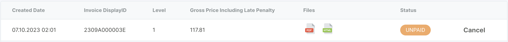
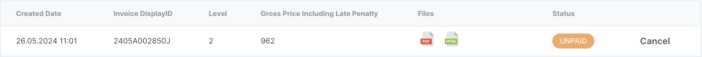

Der Reiter "Erinnerungen" im Aadvanto Abrechnungssystem ist dazu gedacht, unbezahlte Rechnungen zu verwalten, indem Benachrichtigungen an Kunden gesendet werden. Das System unterstützt zwei Mahnstufen: Zahlungserinnerung (Stufe 1) und Letzte Mahnung (Stufe 2). Jede Stufe hat einen spezifischen Zweck und eine damit verbundene Aktion, um eine rechtzeitige Zahlung sicherzustellen.

### Mahnstufen

#### Stufe 1: Zahlungserinnerung

Die Zahlungserinnerung, oder "Zahlungserinnerung," ist die erste Stufe der Benachrichtigung, die an Kunden mit überfälligen Rechnungen gesendet wird. Diese Erinnerung dient als sanfter Hinweis an den Kunden, seine ausstehenden Zahlungen zu begleichen. Im Folgenden finden Sie eine detaillierte Erklärung dieser Mahnstufe:

1. **Zweck**: Den Kunden über die überfällige Zahlung informieren und um sofortige Begleichung bitten.
2. **Inhalt**: Enthält die Rechnungsnummer, das Fälligkeitsdatum, den ausstehenden Betrag und eine höfliche Zahlungsaufforderung.
3. **Aktion**: Kunden werden aufgefordert, die Zahlung bis zum neuen angegebenen Datum vorzunehmen, um weitere Erinnerungen zu vermeiden.

**Beispiel einer Zahlungserinnerung:**

#### Stufe 2: Letzte Mahnung

Die Letzte Mahnung, oder "Letzte Mahnung," ist die zweite Stufe der Benachrichtigung, die an Kunden gesendet wird, die die ursprüngliche Zahlungserinnerung ignoriert haben. Diese Erinnerung weist auf die dringende Notwendigkeit der Zahlung hin und enthält mögliche Konsequenzen bei Nichtzahlung. Im Folgenden finden Sie eine detaillierte Erklärung dieser Mahnstufe:

1. **Zweck**: Den Kunden über die überfällige Zahlung in einem dringlicheren Ton informieren und vor weiteren Maßnahmen bei Nichtzahlung warnen.
2. **Inhalt**: Enthält die Rechnungsnummer, das Fälligkeitsdatum, den ausstehenden Betrag, eventuelle zusätzliche Gebühren (z.B. Mahngebühren) und eine letzte Zahlungsaufforderung.
3. **Aktion**: Kunden wird eine letzte Frist zur Zahlung gegeben. Bei Nichteinhaltung können weitere Maßnahmen ergriffen werden, wie die Einschaltung eines Inkassobüros.

**Beispiel einer Letzten Mahnung:**

### Verständnis der Mahnstufen

Beide Mahnstufen spielen eine entscheidende Rolle im Zahlungseinzugsprozess:

- **Zahlungserinnerung**: Ein sanfter Hinweis, der den Kunden an eine überfällige Rechnung erinnert und eine Zahlung innerhalb einer kurzen Schonfrist anfordert.
- **Letzte Mahnung**: Eine ernsthaftere Benachrichtigung, die die Dringlichkeit der Zahlung betont und vor möglichen Konsequenzen warnt, wie die Einschaltung eines Inkassobüros.

Durch das Verständnis und die effektive Nutzung dieser Mahnstufen können Sie rechtzeitige Zahlungen sicherstellen und gute Kundenbeziehungen aufrechterhalten.