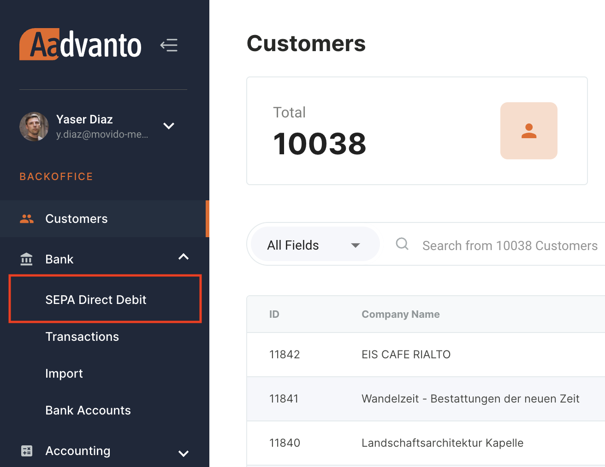
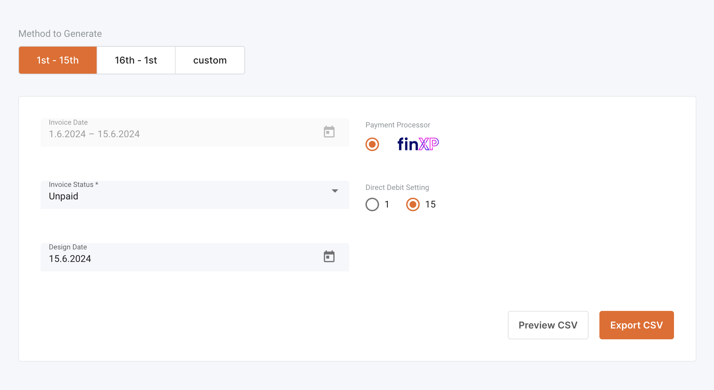
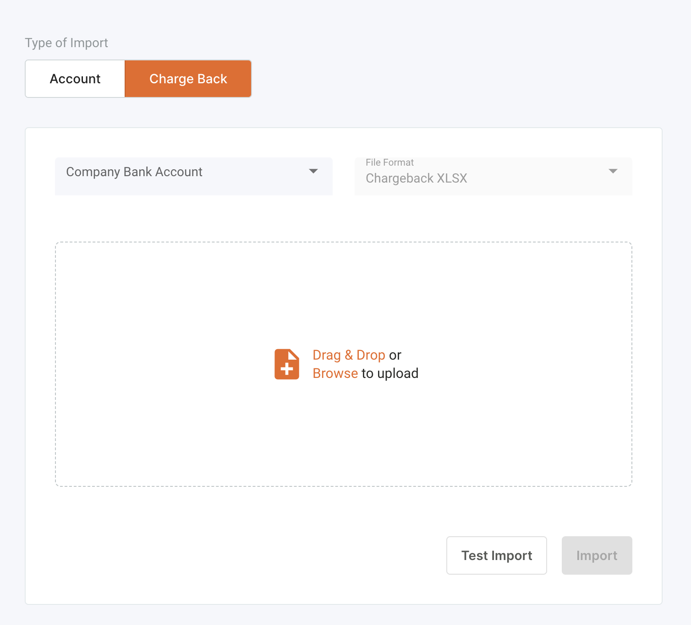

Das SEPA-Lastschrift-Menü ermöglicht Ihnen eine effiziente Verwaltung von SEPA-Lastschrifttransaktionen. Unser Abrechnungssystem integriert sich mit FinXP, um diese Transaktionen abzuwickeln.

### Zugriff auf SEPA-Lastschrift

1. **Navigieren Sie zur SEPA-Lastschrift:**
   - Gehen Sie im Seitenmenü zu `Bank`.
   - Wählen Sie `SEPA-Lastschrift`.

   

### SEPA-Lastschriftdateien generieren

1. **Methode zur Dateierstellung wählen:**
   - Wählen Sie im SEPA-Lastschrift-Menü `Datei generieren`.
   - Wählen Sie den Datumsbereich: `1. - 15.`, `16. - 1.` oder `benutzerdefiniert`.

   

2. **Parameter festlegen:**
   - **Rechnungsdatum:** Wählen Sie den Datumsbereich für die Rechnungen.
   - **Rechnungsstatus:** Wählen Sie zwischen `Unbezahlt`, `Bezahlt` oder `Storniert`.
   - **Design-Datum:** Legen Sie das Design-Datum für die Lastschrift fest.
   - **Zahlungsabwickler:** Wählen Sie `FinXP`.
   - **Lastschrift-Einstellung:** Wählen Sie entweder `1` oder `15` für die Einstellung.

3. **CSV-Vorschau und Export:**
   - Klicken Sie auf `CSV-Vorschau`, um die Datei zu überprüfen.
   - Klicken Sie auf `CSV exportieren`, um die Datei für den Upload zu FinXP zu erstellen.

## Exportjobs und Anweisungen

### Verwaltung von Exportprotokollen

Der Reiter Exportjobs bietet ein umfassendes Protokoll aller generierten SEPA-Lastschriftdateien. Dies ist unerlässlich, um Ihre SEPA-Lastschriftaktivitäten zu verfolgen und zu verwalten. Es hilft sicherzustellen, dass alle notwendigen Transaktionen verarbeitet wurden und ermöglicht eine einfache Fehlerbehebung bei Problemen.

1. **Zugriff auf Exportprotokolle:** Wählen Sie im SEPA-Lastschrift-Bereich den Reiter `Exportjobs`. Dies zeigt eine Liste aller generierten Dateien an.
   
2. **Exportierte Dateien anzeigen:** Das Exportprotokoll enthält Details wie ID, Erstellungsdatum, Design-Datum, Rechnungsdatumsbereich, Lastschrift-Einstellung, Zahlungsabwickler und Rechnungsstatus. Durch Überprüfung dieses Protokolls können Sie genaue Aufzeichnungen aller SEPA-Lastschriftaktivitäten führen.

### Verwaltung von Lastschrifteinzügen

Der Reiter Lastschrifteinzüge wird verwendet, um die Lastschrifteinzüge für ein bestimmtes Datum zu verwalten. Diese Funktion hilft bei der Organisation und stellt sicher, dass alle Lastschrifteinzüge korrekt befolgt und verarbeitet werden.

1. **Navigieren Sie zu Lastschrifteinzüge:** Wählen Sie im SEPA-Lastschrift-Bereich den Reiter `Lastschrifteinzüge`.
   
2. **Design-Datum auswählen:** Wählen Sie das Design-Datum aus, für das Sie die Lastschrifteinzüge anzeigen oder exportieren möchten. Dies hilft, bestimmte Anweisungsbatches effizient zu verwalten.

3. **Anweisungen exportieren:** Wenn Anweisungen für das ausgewählte Datum verfügbar sind, können Sie diese als CSV-Datei exportieren, indem Sie auf `Als CSV exportieren` klicken. Diese Datei kann dann verwendet werden, um sicherzustellen, dass alle Lastschrifteinzüge korrekt von FinXP verarbeitet werden.

## SEPA-Rücklastschriften

SEPA-Rücklastschriften ermöglichen es Ihnen, Rückerstattungen oder zurückgegebene Zahlungen von Kunden effizient zu verwalten.

### Zugriff auf Rücklastschriften-Import

1. **Navigieren Sie zum Rücklastschriften-Import:**
   - Gehen Sie im Seitenmenü zu `Bank`.
   - Wählen Sie `Import`.
   - Klicken Sie auf den Reiter `Rücklastschrift`.

   

### Rücklastschriften-Datei importieren

1. **Rücklastschriften-Datei hochladen:**
   - **Firmenbankkonto:** Wählen Sie das Bankkonto.
   - **Dateiformat:** Wählen Sie das Dateiformat (z.B. Rücklastschrift XLSX).
   - Ziehen Sie die Rücklastschriften-Datei per Drag & Drop oder durchsuchen Sie, um sie hochzuladen.

2. **Testen und Importieren:**
   - Klicken Sie auf `Testimport`, um das Dateiformat zu überprüfen.
   - Klicken Sie auf `Importieren`, um die Rücklastschriften zu verarbeiten.

### Verarbeitung von Rücklastschriften

Nach dem Import der Rücklastschriften-Datei wird das System:
- Die entsprechenden Rechnungen als unbezahlt markieren.
- Notwendige Erinnerungen oder Benachrichtigungen an die Kunden bezüglich ihres Zahlungsstatus senden.

## Bedeutung von SEPA-Lastschrift und Rücklastschriften

### Effizienz bei Transaktionen

Die Verwendung der SEPA-Lastschrift stellt sicher, dass alle Lastschrifttransaktionen reibungslos und automatisch über FinXP abgewickelt werden. Dies reduziert den manuellen Arbeitsaufwand und minimiert Fehler bei finanziellen Transaktionen.

### Umgang mit Rückerstattungen und zurückgegebenen Zahlungen

SEPA-Rücklastschriften sind entscheidend für die Verwaltung von Rückerstattungen oder zurückgegebenen Zahlungen. Durch den Import von Rücklastschriften-Dateien aktualisiert das System automatisch die Rechnungsstatus und sendet Erinnerungen an Kunden, um sicherzustellen, dass alle Finanzaufzeichnungen korrekt und aktuell sind.

## Fazit

Die Funktionen SEPA-Lastschrift und Rücklastschriften in unserem Abrechnungssystem vereinfachen den Prozess der Verwaltung von Lastschrifttransaktionen und der Bearbeitung von Rücklastschriften. Durch die Integration mit FinXP stellt unser System eine effiziente und genaue Verarbeitung sicher, wodurch Sie reibungslose Finanzoperationen aufrechterhalten können.