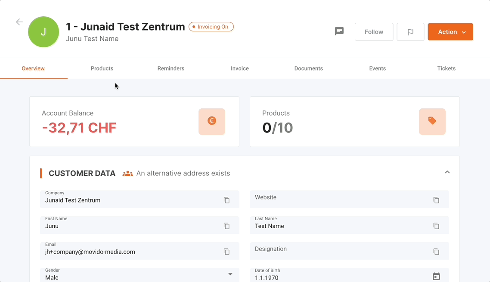
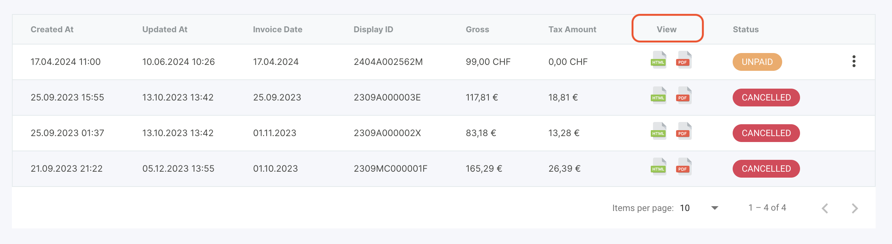
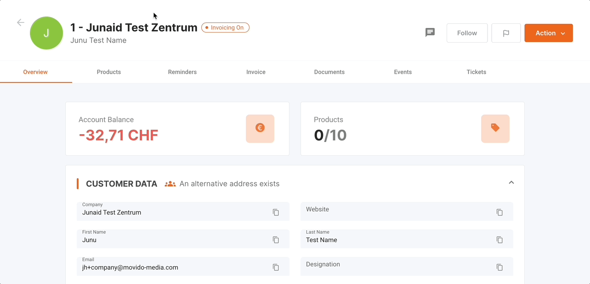
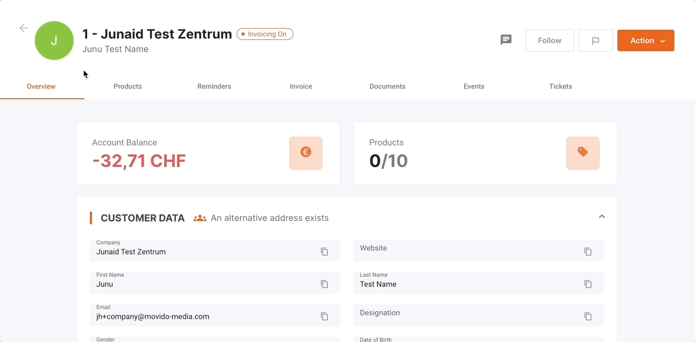
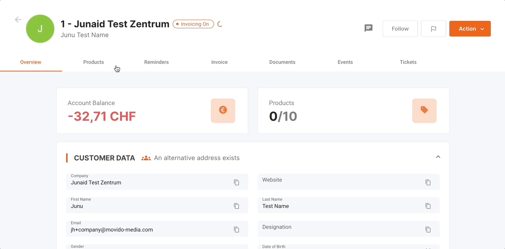
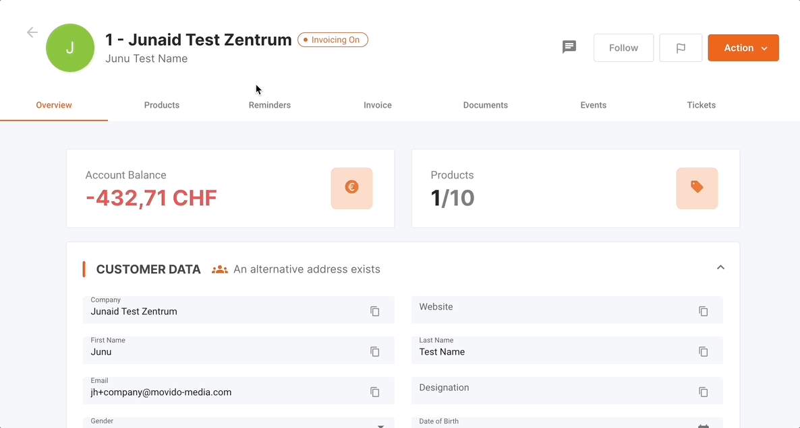

The Invoices tab in the Aadvanto Billing System is designed to manage all customer invoices. This section covers viewing, sending, cancelling, marking as paid, and delaying invoices. Below are detailed instructions on how to use these features effectively.

### Viewing an Invoice

To view an invoice, follow these steps:

1. **Navigate to Invoices Tab**: Go to the Invoices tab where you can see a list of all invoices categorized by status: Paused, Unpaid, Paid, and Future Invoices.

   

2. **Locate the Invoice**: Find the invoice you want to view. The table displays the following information for each invoice:
   - **Creation Date**: The date and time when the invoice was created.
   - **Last Updated**: The last date and time the invoice was updated.
   - **Invoice Date**: The official date of the invoice.
   - **Display ID**: A unique identifier for the invoice.
   - **Gross Amount**: The total amount due including any taxes.
   - **Tax Amount**: The tax component of the total amount.
   - **Visibility**: Indicates whether the invoice is available in HTML or PDF format.
   - **Status**: Shows the current status of the invoice (e.g., Unpaid, Paid, Cancelled).

3. **Access Invoice Details**: Under the "View" tab, click on the PDF icon to download the invoice as a PDF file or the HTML icon to view the invoice in your browser.

   

This action will allow you to directly access the full invoice with all relevant information in your preferred format.

### Sending an Invoice

**To send an invoice to a customer, follow these steps:**

1. **Navigate to Documents Tab**: Go to the Documents tab and locate the invoice you wish to send. You can visualize the invoice needed by sorting through criteria like created date or name.

2. **Open Actions Menu**: Click on the three dots menu (⋮) next to the invoice status to open the dropdown menu.

3. **Select Share**: From the dropdown menu, select "Share by Email" or "Share by Post". This will open a dialog box where you can choose the method of sending the invoice. Confirm the recipient's details and send the invoice.

   

### Cancelling an Invoice

To cancel an invoice, follow these steps:

1. **Navigate to Invoices Tab**: Go to the Invoices tab and find the invoice you need to cancel.

2. **Open Actions Menu**: Click on the three dots menu (⋮) next to the invoice status to open the dropdown menu.

3. **Select Cancel**: From the dropdown menu, select "Cancel" to initiate the cancellation process. This will open a cancellation dialog.

4. **Provide Cancellation Reason**: In the dialog box that appears, you will need to provide a reason for the cancellation. This reason is important for record-keeping and audit purposes.

5. **Confirm Cancellation**: After entering the reason, click on "Cancel Invoice" to confirm the cancellation. The invoice status will be updated to "Cancelled" and the record will reflect this change.

 

### Manually Marking an Invoice as Paid

To mark an invoice as paid manually, follow these steps:

1. **Navigate to Invoices Tab**: Go to the Invoices tab and find the invoice you need to mark as paid.

2. **Open Actions Menu**: Click on the three dots menu (⋮) next to the invoice status to open the dropdown menu.

3. **Select Mark as Paid**: From the dropdown menu, select "Mark as Paid." This will open a confirmation dialog.

4. **Confirm the Action**: Click "Confirm" to mark the invoice as paid. The status of the invoice will change to "Paid."

   

### How to Manually Write Off an Invoice

The "Write Off" feature allows you to handle small discrepancies in payment amounts, ensuring invoices are considered settled even with minor outstanding amounts.

### Steps to Write Off an Invoice:

1. **Locate the Invoice:**
   - Navigate to the "Invoices" section from the main menu.
   - Find the specific invoice that needs to be written off.

2. **Access the Options Menu:**
   - Click on the three dots menu (⋮) next to the invoice status.

3. **Select "Write Off Invoice":**
   - Choose the "Write off invoice" option from the dropdown menu.

4. **Confirm the Write Off:**
   - A confirmation dialog will appear. Confirm the action to write off the minor discrepancy.

   

### Delaying an Invoice

To delay an invoice, follow these steps:

1. **Navigate to Invoices Tab**: Go to the Invoices tab and find the invoice you need to delay.

2. **Open Actions Menu**: Click on the three dots menu (⋮) next to the invoice status to open the dropdown menu.

3. **Select Delay**: From the dropdown menu, select "Delay" to postpone the invoice due date. This will open a delay dialog.

4. **Provide New Date**: In the dialog box that appears, select the new date for the invoice due date.

5. **Confirm the Action**: Click "Confirm" to delay the invoice. The due date of the invoice will be updated accordingly.

   

### Additional Invoice Actions

The dropdown menu also provides additional actions that can be performed on an invoice:

- **Regenerate Document**: If there are updates or corrections needed, you can regenerate the invoice document.

By following these steps, you can efficiently manage all invoicing tasks within the Aadvanto Billing System, ensuring accurate and up-to-date financial records.