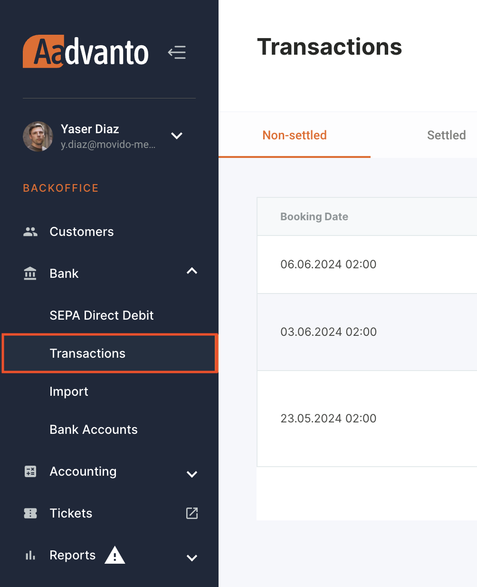
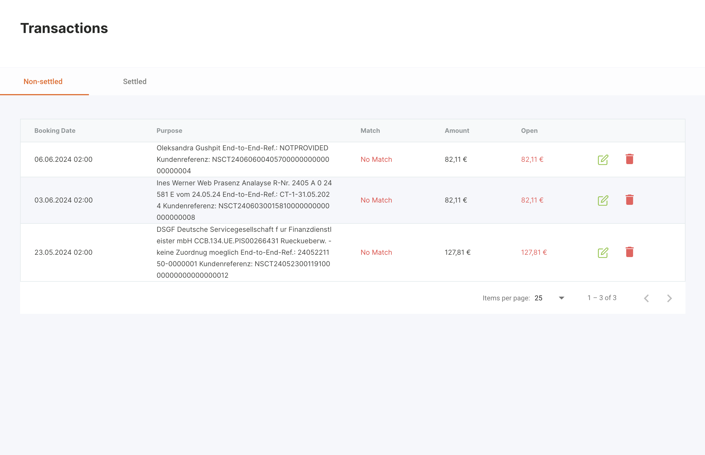
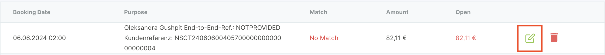
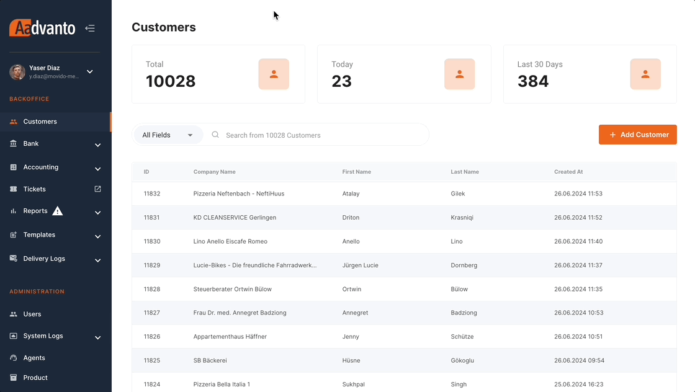
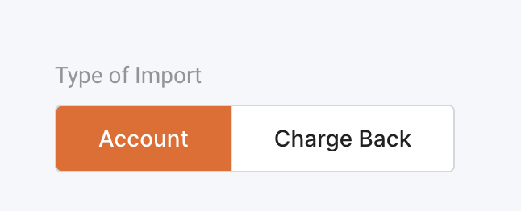
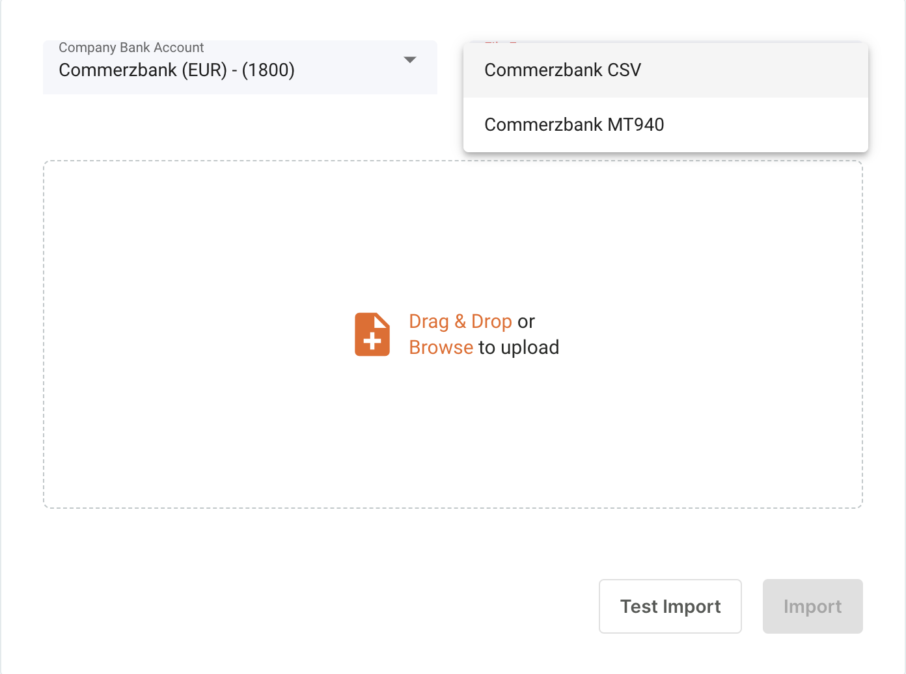

The Transactions tab in the Aadvanto Billing System is essential for managing and booking payments. This section covers the process of assigning a payer and booking a payment. Below are detailed instructions on how to use these features effectively.

### Booking a Payment / Assigning a Payer

To book a payment or assign a payer, follow these steps:

1. **Navigate to Transactions Tab**: Go to the Transactions tab under the Bank section. Here, you will find all the payments that have been received in your account on that day.

   

2. **Locate the Payment**: Find the payment you want to book. The table displays the following information for each transaction:
   - **Booking Date**: The date and time when the payment was received.
   - **Purpose**: The purpose or description of the transaction.
   - **Match**: Indicates whether the payment has been matched to a customer or invoice.
   - **Amount**: The total amount of the payment.
   - **Open**: The open amount yet to be allocated.

   

3. **Edit the Payment**: Click on the green edit icon next to the transaction you want to book. This will open a new window where you can assign the payer and book the payment.

   

4. **Assign a Payer**: In the booking window, you will see the transaction details. Use the Customer search field to find and select the appropriate customer for this payment.

5. **Match the Customer**: Start typing the name of the customer in the search field. Select the correct customer from the dropdown list.

6. **Add Credit to Customer's Account**: Once the customer is selected, click on "Add Credit to Customer's Account" to allocate the payment as credit to the customer's account.

7. **Select Invoice (if applicable)**: If the payment is meant to settle a specific invoice, use the "Select from invoices" dropdown to choose the invoice. The system will display a list of invoices that can be selected.

8. **Enter Booking Amount**: Ensure the booking amount matches the amount of the open invoice. If it's a partial payment, enter the appropriate amount.

9. **Confirm the Booking**: Once all details are correctly entered, click on the "Confirm" button to finalize the booking of the payment. The transaction will now be marked as settled and the customer's account will be updated accordingly.

  

By following these steps, you can efficiently manage all transaction booking tasks within the Aadvanto Billing System, ensuring accurate and up-to-date financial records.

## Understanding Partial Payments

### What is a Partial Payment?

A partial payment occurs when a customer makes a payment that is less than the total amount due on an invoice. Instead of waiting for the full payment to be made, you can record the portion of the payment that has been received. This helps in keeping the financial records accurate and up-to-date while acknowledging the payment that has been made.

### Why Use Partial Payments?

Partial payments are useful in situations where:
- The customer is unable to pay the full amount due immediately but makes a partial payment as a goodwill gesture.
- It helps in maintaining cash flow by recording the received amount promptly.
- It ensures transparency in financial transactions and outstanding balances.

### Steps to Record a Partial Payment:

1. **Navigate to Transactions:**
   - Go to the `Bank` section from the main menu and select `Transactions`.
   - Here you will find all the payments that have been received in the company's bank account.

2. **Edit the Transaction:**
   - Find the relevant transaction and click on the green `edit` icon.
   - This will open the booking transaction window.

3. **Search for the Invoice:**
   - In the booking transaction window, search for the customer or the specific invoice that the partial payment is related to.

4. **Allocate the Partial Payment:**
   - Enter the amount that has been received in the `Booking Amount` field.
   - Ensure that the entered amount is less than the total amount due on the invoice.

5. **Add Credit to Customer's Account:**
   - If there is any unallocated amount, you can choose to add it as a credit to the customer's account.
   - This credit can be used to offset future invoices or remaining balances.

6. **Confirm the Allocation:**
   - Once the partial payment has been entered, review the details and click `Confirm` to record the partial payment.

### Example Scenario:

For instance, if a customer has an outstanding invoice of 99€ but only pays 49€, you would:
- Enter 49€ in the "Booking Amount" field for that specific invoice.
- The system will then show the remaining balance of 50€ as still due.

By following these steps, you can efficiently manage and record partial payments, ensuring that both your financial records and customer balances remain accurate.

## Importing Bank Transactions

In this section, we will discuss the process of importing bank transactions into our billing system. This feature is crucial for ensuring all transactions are accurately recorded and managed within our system.

### Navigating to the Import Section

1. **Access the Import Menu**
   - Navigate to the "Bank" section on the left sidebar.
   - Select "Import" from the dropdown menu under "Bank".

   

### Setting Up the Import

2. **Choose the Type of Import**
   - You will have two options: `Account` and `Charge Back`. Select `Account` for regular bank transaction imports.
   
   

3. **Select Company Bank Account and File Format**`
   - From the dropdown menu under `Company Bank Account`, select the relevant bank account from which you wish to import transactions. The system supports multiple bank accounts and payment processors, including:
     - Commerzbank (EUR)
     - Nationalbank (EUR)
     - Raiffeisenbank (EUR & CHF)
     - Paypal (EUR, USD & CHF)
     - Amex
   
   - Next, choose the file format. Common formats include `CSV` and `MT940`.

   

4. **Upload the File**
   - Drag and drop the transaction file into the designated area or click on `Browse to upload`.

### Import Process

5. **Downloading Transaction Files**
   - Log in to each bank account where you have an account, for example, National Bank.
   - Download the transaction file in the appropriate format (e.g., CSV).

6. **Test Import**
   - Before finalizing the import, perform a `Test Import` to check for any errors and ensure the file is correctly formatted. This step is important to avoid any discrepancies during the actual import process.

7. **Finalize Import**
   - Once the test import is successful, click on `Import` to finalize the process. The transactions will now be imported into the system, ready for assignment and booking.

### Refunds Management

In our billing system, managing refunds is an integral part of the bank import process. Just as we import transactions from a bank to assign payments to customers, our billing system also tracks transactions that involve refunds. These refunds, which are essentially transactions that return funds to customers, are displayed as negative amounts in our system.

Here's a step-by-step explanation of how refunds are handled within the bank import process:

#### Importing Refund Transactions

1. **Navigate to the Import Section**: 
   - From the left-hand navigation menu, click on **Bank** and then select **Import**.
   
2. **Select Import Type**:
   - In the import interface, you have two options: **Account** and **Charge Back**. Select **Account** to proceed with importing bank transactions.
   
3. **Choose Bank Account and File Format**:
   - From the dropdown menus, select the appropriate company bank account and the file format for the import (e.g., CSV, MT940).
   
4. **Upload the File**:
   - Drag and drop the file containing the bank transactions, or click **Browse** to upload it.
   
5. **Test and Import**:
   - Click **Test Import** to review the data and ensure everything looks correct. If everything is in order, click **Import** to proceed.

#### Managing Refund Transactions

Once the bank transactions are imported, including any refunds, these transactions will be listed in the system:

1. **Viewing Refund Transactions**:
   - Refund transactions will be displayed in the transaction list under **Non-settled** with a negative amount, indicating a refund. 

2. **Assigning Refunds**:
   - Similar to booking a payment, refunds can be assigned to the respective customer or invoice. Click on the green **Edit** icon next to the refund transaction.
   
3. **Search and Assign**:
   - In the **Book Transaction** window, search for the customer or invoice related to the refund. Once found, assign the refund accordingly.
   
4. **Finalizing the Assignment**:
   - After assigning the refund to the correct customer or invoice, confirm the assignment. The refund will be logged, reducing the outstanding balance or crediting the customer's account as appropriate.

By following these steps, refunds are accurately tracked and managed within the billing system, ensuring that all transactions, both incoming and outgoing, are properly recorded and accounted for.

---

This concludes the section on managing refunds in our billing system. Understanding and utilizing these steps ensures that refunds are handled efficiently, maintaining accurate financial records for both the company and its customers.

### Customer Credit Management

In the event that a customer sends a payment twice for the same invoice, our billing system allows for efficient handling of such situations by managing customer credit. Here’s how we handle duplicate payments:

#### Assigning the Duplicate Payment

1. **Import the Transaction**:
   - As usual, import the transaction from the bank into the billing system through the **Import** process.

2. **Assign the Payment**:
   - Navigate to **Bank** > **Transactions** and locate the duplicate payment. Click the green **Edit** icon to assign the payment.

3. **Search and Assign**:
   - In the **Book Transaction** window, search for the customer and assign the payment to their account.

#### Managing Customer Credit

Once the duplicate payment is assigned, you have two options for handling the extra funds:

1. **Apply as Credit for Future Invoices**:
   - The extra payment can be kept as a credit in the customer’s account. This credit can be automatically applied to future invoices, reducing the amount the customer needs to pay next time.

2. **Issue a Refund**:
   - Alternatively, the customer can request a refund for the duplicate payment. The refund process follows the same steps as other refunds, where the transaction is processed and the funds are returned to the customer.

By managing customer credits efficiently, our billing system ensures that duplicate payments are handled smoothly, providing flexibility and convenience for both the customer and the company.

### Importance of Importing Bank Transactions

Importing bank transactions is a critical step in the billing process. It ensures that all financial activities are accurately recorded and managed within the billing system. This process helps in:
- Maintaining accurate financial records.
- Ensuring timely and accurate invoicing.
- Streamlining the reconciliation process between bank statements and system records.
- Improving financial reporting and analysis.

By following these steps, you can efficiently import bank transactions into our billing system, ensuring all financial data is up-to-date and accurate.