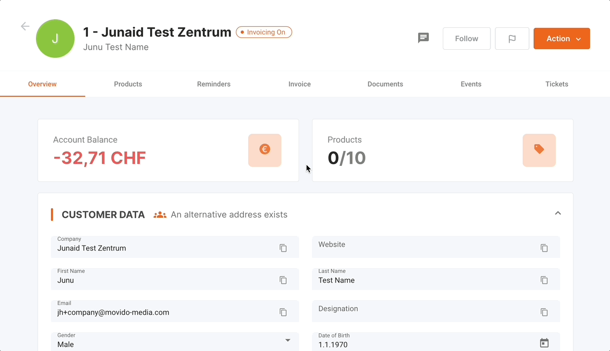

The Product Management tab in our Aadvanto Billing System allows users to manage all aspects of customer products. This section covers viewing existing products, booking new products, managing cancellations, and updating product details. Below are detailed descriptions of the available functions in the Product Management section.

### Existing Products

In the Product Management overview, you can view all existing products associated with a customer. Each product entry includes details such as:

- **Product Name**: The name of the product.
- **Booking Date & Time**: When the product was booked.
- **Contract Period**: The duration of the contract for the product.
- **Service Period**: The active service period for the product.
- **First Invoice Status**: Indicates whether the first invoice is paid or unpaid.
- **Product Status**: Shows if the product is active, booked, or expired.

You can filter the products by their status (All, Active, Booked, Expired) to easily find specific products.

### Booking a Onetime Product

To book a one-time product for a customer, follow these steps:

1. **Choose Product**: Select the desired product from the available options. Products are categorized based on their type and term duration. You can see the product name, term duration, and price for each option.

   

2. **Contract Timeline & Pricing**: Set the details for the selected product, including:
   - **Start Date**: The date when the product service will begin.
   - **Service Period Postponement**: Number of days to postpone the service period if needed.
   - **Billing Interval**: The frequency of billing (e.g., daily, monthly).
   - **Duration**: Total duration of the contract.
   - **Notice Period**: The notice period for any changes or cancellations.
   - **Subcontractor**: Assign a subcontractor if applicable.
   - **Agent**: Assign an agent if applicable.
   - **Notes**: Add any relevant notes for the booking.

   

3. **Price Settings**: Define the pricing for the product:
   - **Net Price**: The base price of the product.
   - **Setup Fee**: Any additional setup fee required.
   - **Discount**: Apply any discounts if available.
   - **Silent Discount**: Indicate if the discount should be applied silently without notifying the customer.

4. **Summary**: Review and confirm the booking details before finalizing the process. Ensure all information is correct, then click "Next" to complete the booking.

### Cancelling a Product

To cancel an existing product, follow these steps:

1. **Access Products**: Go to the "Products" tab in the customer overview to see the existing products. Navigate to the specific product you wish to cancel.

   

2. **Termination Notice**: Scroll down to find the "Termination Notice" section and click on "Add termination notice" to initiate the cancellation process.

   

3. **Provide Details**: Select the termination type (Immediate or In due time), specify the reason for cancellation, and any additional notes.

4. **Confirm Cancellation**: Confirm the cancellation. The system will update the product status to reflect the cancellation.

### Withdrawing a Cancellation of a Product

If a product cancellation needs to be withdrawn, follow these steps:

1. **Access Product Details**: Go to the product that has a pending cancellation.
2. **Withdraw Cancellation**: Find the cancellation entry and update the status to withdraw the cancellation.
3. **Confirm Changes**: Confirm the changes to revert the product to its active or booked state.

### Changing the Price of a Product

To change the price of a product, follow these steps:

1. **Access Product Details**: Navigate to the product you wish to update. Click on "View product details" to open the product's detail page.

   

2. **Price Settings**: Locate the "Price Settings" section.

   

3. **Update Pricing**: Adjust the net price, setup fee, and any applicable discounts.
4. **Save Changes**: Save the updates to apply the new pricing.

### Changing the Contract Duration of a Product

To modify the contract duration for a product, follow these steps:

1. **Access Product Details**: Go to the product you want to update. Click on "View product details" to open the product's detail page.
2. **Contract Timeline & Pricing**: In the product details, adjust the start date, billing interval, and duration as needed.
3. **Save Changes**: Save the updates to apply the new contract terms.

### Terminating a Product Immediately

For immediate termination of a product, follow these steps:

1. **Access Product Details**: Navigate to the product you wish to terminate. Click on "View product details" to open the product's detail page.
2. **Termination Notice**: Click on "Add termination notice" and specify that the termination should be immediate.
3. **Provide Details**: Fill in any necessary information and notes.
4. **Confirm Termination**: Confirm the termination to complete the process.

### Subscription Products

Subscription products, also known as recurring billing products, differ from one-time products as they involve ongoing payments at regular intervals. These products may have varying contract periods and service terms based on customer needs.

#### Managing Subscription Products

1. **Viewing Subscriptions**: Access the subscription product details to view the contract period, billing interval, and service period. 
2. **Updating Subscription Details**: You can update the price, contract duration, and other settings similarly to one-time products.
3. **Cancelling Subscriptions**: Follow the same process as cancelling one-time products but ensure to specify the correct termination type.

By utilizing the Product Management tab in the Aadvanto Billing System, you can efficiently manage all aspects of customer products, ensuring accurate and up-to-date information at all times.