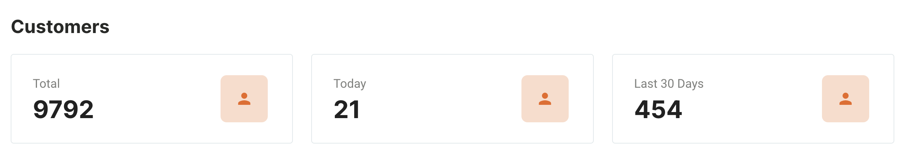

The Advanto Billing System dashboard provides you with essential key metrics to help you monitor and manage your business effectively. This page will guide you through the key metrics displayed on the dashboard, explaining what each one represents and why they are important.

### Key Metrics Overview

The key metrics section on the dashboard displays three primary metrics:

1. **Total Customers**
2. **Customers Added Today**
3. **Customers Added in the Last 30 Days**

### Detailed Explanation of Each Metric

#### Total Customers

- **Description**: This metric shows the total number of customers in the system.
- **Calculation**: It is the sum of all customers added to the system to date.
- **Importance**: Knowing the total number of customers helps you understand the scale of your customer base and overall business growth.

##### Customers Added Today

- **Description**: This metric indicates the number of new customers added to the system today.
- **Calculation**: It counts all customers created from midnight to the current time of the day.
- **Importance**: Monitoring daily new customers helps you track the immediate impact of your marketing and sales efforts.

#### Customers Added in the Last 30 Days

- **Description**: This metric shows the number of new customers added in the past 30 days.
- **Calculation**: It counts all customers created within the last 30 days from the current date.
- **Importance**: This metric provides a broader view of recent customer acquisition trends, helping you assess the effectiveness of your strategies over a month.

### Visual Indicators

The dashboard uses clear visual indicators to display these metrics:

- **Total Customers**: Displayed with a user icon and the total count.
- **Customers Added Today**: Displayed with a user icon and the count for today.
- **Customers Added in the Last 30 Days**: Displayed with a user icon and the count for the last 30 days.

These visual elements help you quickly understand and assess your key metrics at a glance.

### Examples and Use Cases

#### Example 1: Daily Performance Monitoring

You can use the "Customers Added Today" metric to gauge the success of a daily promotional campaign. If you notice a spike in new customers, it indicates that your campaign is effective.

#### Example 2: Monthly Growth Assessment

The "Customers Added in the Last 30 Days" metric allows you to track monthly growth trends. If you see a consistent increase, it suggests that your long-term strategies are working well.

### Tips for Using Metrics Effectively

- **Set Benchmarks**: Establish benchmarks for each metric to evaluate performance over time.
- **Regular Review**: Schedule regular reviews of your key metrics to identify trends and make data-driven decisions.
- **Actionable Insights**: Use the insights gained from these metrics to refine your marketing strategies, improve customer engagement, and drive business growth.

---

**Next Steps**: With a clear understanding of key metrics, proceed to explore other features of the Advanto Billing System, such as managing customers, transactions, and generating reports. The next section will guide you through managing customer data.